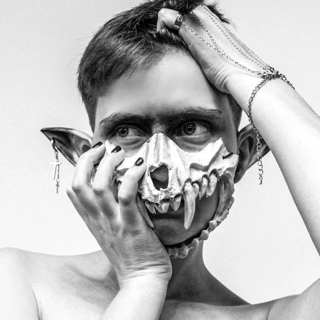

## Personal information

* __Budylina Elizaveta__
* __+7 910 101 40 02__
* _I'm trainee frontend developer from Kazan, study in School 21. I'm very passionate about this direction and I want to develop further in it._

## Programming and other skills

* code example:
    * `const multiply = (a, b) => a * b;`

* projects:
    * "Hakaton "Полюс Золота": https://github.com/WilliamsCommando/hakaton_polus_zolota
    * library matrix in C: https://github.com/WilliamsCommando/s21_matrix
* _I have no work experience._

* __My education:__

    1. College Lobashevsky, Information Systems
    2. School 21

* __My English lvl: _B1___